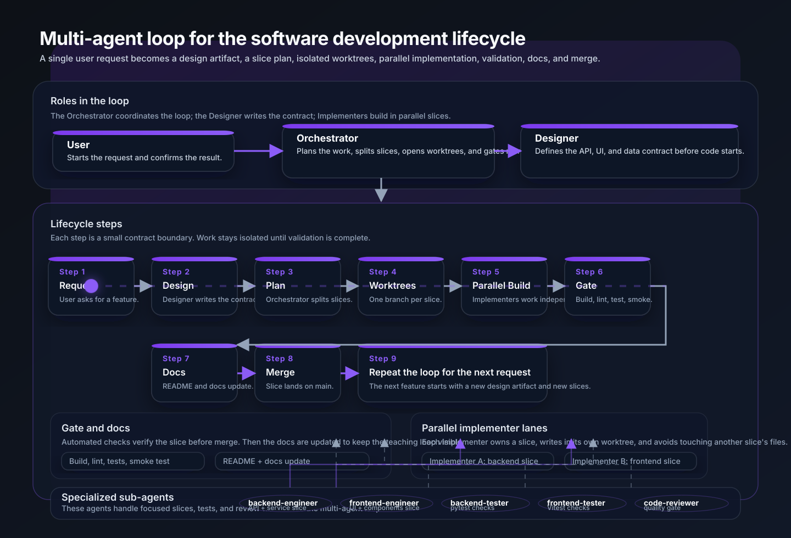

# Multi-Agentic Loop Lab

I built this repo to document my own learning process using **multi-agent orchestration** with GitHub Copilot. The app is a simple blog, but the blog is just the vehicle. What I'm really capturing here is the agent system I put together: the custom agents, the instructions, the prompt files, and the workflow patterns that took shape as I built each feature.

If you're trying to figure out how to use VS Code, GitHub Copilot, and Git worktrees to coordinate multiple AI agents through a development cycle, this shows one way to do it.

---

## What This Repo Is About

My starting question was pretty simple: can a handful of purpose-built agents, each working on its own slice of a codebase, actually ship a working web app with only light human steering?

After building several features this way, the answer is yes. But it requires structure. This repo is that structure.

What I found is that agents do their best work when they have a specific set of files they own, a written contract they can refer back to, and a scope narrow enough that they never have to guess what's out of bounds. The Orchestrator runs the loop but doesn't touch the code. The Designer writes the spec but doesn't implement. The Implementers build without making design calls. When roles stay clean, the whole thing moves fast.

---

## The Agent System

Everything that drives the agents lives in `.github/`, organized into three layers.

### Agent mode files in `.github/agents/`

Each file defines a custom Copilot agent mode: its role, the tools it can use, and the boundaries it stays within.

| Agent | Role |
|---|---|
| [`orchestrator.agent.md`](.github/agents/orchestrator.agent.md) | Plans the work, coordinates agents, gates merges, updates docs |
| [`designer.agent.md`](.github/agents/designer.agent.md) | Reads the codebase and produces the design artifact (no code writing) |
| [`implementer.agent.md`](.github/agents/implementer.agent.md) | Builds one vertical slice end-to-end from a task file |
| [`backend-engineer.agent.md`](.github/agents/backend-engineer.agent.md) | FastAPI specialist for backend slices |
| [`frontend-engineer.agent.md`](.github/agents/frontend-engineer.agent.md) | React/TypeScript specialist for frontend slices |
| [`backend-tester.agent.md`](.github/agents/backend-tester.agent.md) | pytest integration test specialist |
| [`frontend-tester.agent.md`](.github/agents/frontend-tester.agent.md) | Vitest component test specialist |
| [`code-reviewer.agent.md`](.github/agents/code-reviewer.agent.md) | Quality gate covering lint, types, test coverage, and readability |

### Copilot instructions in `.github/copilot-instructions.md`

This file sets the ground rules for all agents: no over-engineering, no production infrastructure, keep the code readable, act as a coach. It also spells out what "next" means inside the multi-agent loop so agents don't drift.

### Prompt and task files in `.github/prompts/`

Every feature produces two kinds of files that stick around after the branch merges:

- **Design artifacts** (`design-{feature}.prompt.md`) are written by the Designer. They serve as the single source of truth for what gets built: API shape, data model, UI spec, and how the work splits into slices.
- **Task files** (`task-{slice}.prompt.md`) are written by the Orchestrator. One file per slice, each with ordered implementation steps, a list of files the agent owns, files that are off-limits, and the acceptance criteria.

```
.github/prompts/
├── design-view-post.prompt.md
├── design-create-post-form.prompt.md
├── design-delete-post.prompt.md
├── design-edit-post.prompt.md
├── design-ui-overhaul.prompt.md
├── design-agent-sdlc-workflow.prompt.md
├── task-view-post-ui.prompt.md
├── task-create-post-form-ui.prompt.md
├── task-delete-post-api.prompt.md
├── task-delete-post-ui.prompt.md
├── task-edit-post-api.prompt.md
├── task-edit-post-ui.prompt.md
├── task-ui-overhaul-system.prompt.md
└── task-ui-overhaul-components.prompt.md
```

---

## The Multi-Agent Loop

Each feature follows the same 9-step loop. The app grows one vertical slice at a time, and every step is traceable back to an artifact in this repo.

```
User
 └── Orchestrator  — plans, coordinates, gates
      ├── Designer  — reads codebase, writes design artifact
      └── Implementer × N  — one per slice, isolated worktrees
           ├── backend-engineer / backend-tester
           └── frontend-engineer / frontend-tester / code-reviewer
```

| Step | Who | What |
|---|---|---|
| 1. Request | User | Describes the feature |
| 2. Design | Designer | Produces `design-{feature}.prompt.md` |
| 3. Plan | Orchestrator | Writes `docs/features/{feature}-plan.md` and defines slices |
| 4. Worktrees | Orchestrator | Runs `git worktree add`, one branch per slice |
| 5. Task files | Orchestrator | Writes `task-{slice}.prompt.md` for each slice |
| 6. Build | Implementers | Each agent works in isolation on its own files |
| 7. Gate | Orchestrator | Build, lint, tests, smoke test per slice |
| 8. Docs | Orchestrator | Updates README and `docs/features/{feature}.md` |
| 9. Merge | User | Runs `./merge-slice.sh {slice}` |

📖 **[Full workflow documentation →](./docs/workflow.md)**


---

## Docs

The `docs/` folder tracks every decision and outcome as features land.

| Doc | Purpose |
|---|---|
| [docs/workflow.md](docs/workflow.md) | End-to-end loop walkthrough with diagram |
| [docs/architecture.md](docs/architecture.md) | Backend and frontend structure |
| [docs/api-reference.md](docs/api-reference.md) | All endpoints and payload shapes |
| [docs/features/](docs/features/) | One page per shipped feature |

---

## Features Shipped

Each row is a completed loop iteration.

| Feature | Slices | Design artifact | Plan |
|---|---|---|---|
| View post | 1 frontend | [design](/.github/prompts/design-view-post.prompt.md) | — |
| Create post | 1 frontend | [design](/.github/prompts/design-create-post-form.prompt.md) | — |
| Delete post | 1 backend tests + 1 frontend | [design](/.github/prompts/design-delete-post.prompt.md) | [plan](docs/features/delete-post-plan.md) |
| Edit post | 1 backend tests + 1 frontend | [design](/.github/prompts/design-edit-post.prompt.md) | [plan](docs/features/edit-post-plan.md) |

## In Progress

| Item | Plan |
|---|---|
| Full UI overhaul | [plan](docs/features/ui-overhaul-plan.md) |
| SDLC workflow visual docs | [plan](docs/features/agent-sdlc-workflow-plan.md) |

---

## The Blog App

The app is a simple blog built with FastAPI on the backend and React + Vite on the frontend, with in-memory persistence (no database). I kept it deliberately minimal so the agent workflow is the interesting part, not the app itself.

### Tech Stack

| Layer | Technology |
|---|---|
| Backend | Python · FastAPI · uv |
| Frontend | React · TypeScript · Vite |
| Persistence | In-memory (no database) |

### What It Does

- List all posts on the home page
- View a single post on its own detail page
- Create a new post from the top nav via a modal form
- Delete a post from the list or detail page
- Edit a post's title and content inline on the detail page

### Quick Start

```bash
# Backend
cd backend
uv run uvicorn app.main:app --reload --port 8000

# Frontend
cd frontend
npm install && npm run dev

# Both at once
./smoke-test.sh
./stop.sh
```

### Running Tests

```bash
cd backend && PYTHONPATH=. uv run pytest -q && uv run ruff check .
cd frontend && npm run build && npm run lint
```

### Project Structure

```
multi-agentic-loop-lab/
├── .github/
│   ├── agents/              # Custom Copilot agent modes
│   ├── prompts/             # Design artifacts + task files (one per slice)
│   └── copilot-instructions.md
├── docs/
│   ├── workflow.md          # Multi-agent loop walkthrough
│   ├── architecture.md
│   ├── api-reference.md
│   ├── diagrams/            # SVG workflow diagram
│   └── features/            # Feature pages + implementation plans
├── backend/
│   └── app/
│       ├── routers/         # HTTP route handlers
│       ├── schemas/         # Pydantic models
│       ├── models/          # Domain models
│       └── services/        # In-memory business logic
├── frontend/
│   └── src/
│       ├── api/             # Fetch wrappers
│       ├── components/      # TopNav, PostList, PostForm, EditPostForm
│       └── pages/           # HomePage, PostDetailPage
├── smoke-test.sh
├── merge-slice.sh
└── stop.sh
```
